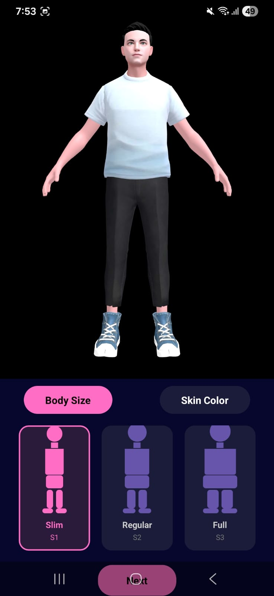
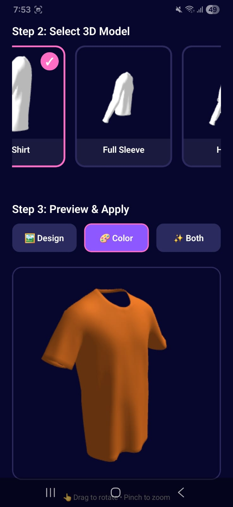
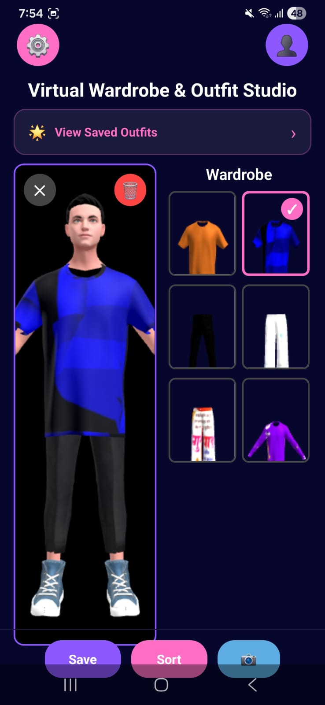

# 👗 Glamware – Virtual Wardrobe & Styling App

Glamware is a mobile application that allows users to create a digital wardrobe, upload their clothing items, and style outfits virtually using a 3D avatar.

---

## 🌟 Problem Statement
Choosing outfits daily can be time-consuming and repetitive. Users often struggle to visualize combinations before actually wearing them.

Glamware solves this by providing a **virtual try-on experience**, helping users mix and match outfits digitally.

---

## 🚀 Features
- 👤 Avatar Creation (3D-based)
- 👚 Upload Personal Clothing Items
- 🎯 Category-based Outfit Selection (one per category)
- 👗 Virtual Outfit Try-On
- 💾 Save Styled Outfits
- 🔐 User Authentication (JWT-based)

---

## 📱 App Screens

### Avatar Screen

### Category Selection

### Wardrobe

---

## 📽️ Demo Video

👉 https://www.linkedin.com/in/mitali-khamkar/

## 🛠️ Tech Stack
- **Frontend:** React Native (Expo)
- **Backend:** Node.js, Express.js
- **Database:** MongoDB
- **Storage:** AsyncStorage
- **3D Rendering:** GLB Models
  

## ⚙️ Project Structure

This project is organized into multiple repositories:

### 📱 Mobile App (Frontend)
👉 https://github.com/mitalikhamkar/Glamware-app  
Contains UI design, app flow, and project overview.

### 🔧 Backend Server
👉 https://github.com/mitalikhamkar/glamware-backend  
Handles API, authentication, and data management.

### 🎨 3D Assets
👉 https://github.com/mitalikhamkar/glamware-assets  
Contains GLB models used for avatar and clothing rendering.

## 🧊 3D Models Note
3D assets are in `.glb` format and cannot be previewed directly on GitHub.  
To view them, download and open using tools like Blender or any GLB viewer.

> Note: To run the complete project, backend setup and assets integration are required.
> Note: The frontend repository currently contains UI previews and project overview. Full implementation details are part of the development environment.
